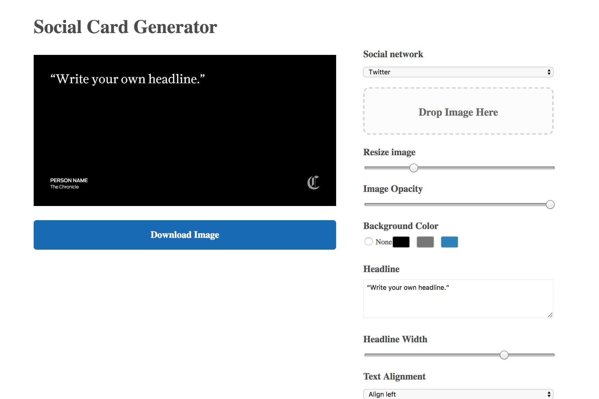

# San Francisco Chronicle's social card generator

The SFChronicle's meme generator is a lightly-modified fork of the [Statesman meme generator](https://github.com/statesman/meme) that is forked from [Vox Media's meme generator](https://github.com/voxmedia/meme). That was modified to work without Ruby (except Compass, which is required to run the build process).

Assets are now built using Grunt, which transpiles the SASS files and concatenates/minifies the JavaScript.

To assist in development, the default Grunt task also:
  * launches a local server at `http://localhost:8000/`
  * starts `grunt-contrib-watch` to watch `index.html` and the .js files in `/source`
  * Livereload is enabled if you are running the [browser extenstions](http://livereload.com/extensions/).

## Deploying

SFChronicle's images, fonts, etc. are currently in the app so you'll need to follow the steps below to customize the app for your use:

1. Add appropriate images to `source/images/`.
2. Edit the settings file at `source/javascripts/settings.js`.
3. Add any fonts you'll need at `source/stylesheets/_fonts.scss`.
4. `npm install`
5. `gem install compass`
6. Run `grunt`

A local server should open at `http://localhost:8000/` where you can use the tool locally.

We run the project through [GitHub pages](https://pages.github.com/) to allow access to the newsroom.

See the original repo at https://github.com/voxmedia/meme for additional info.
